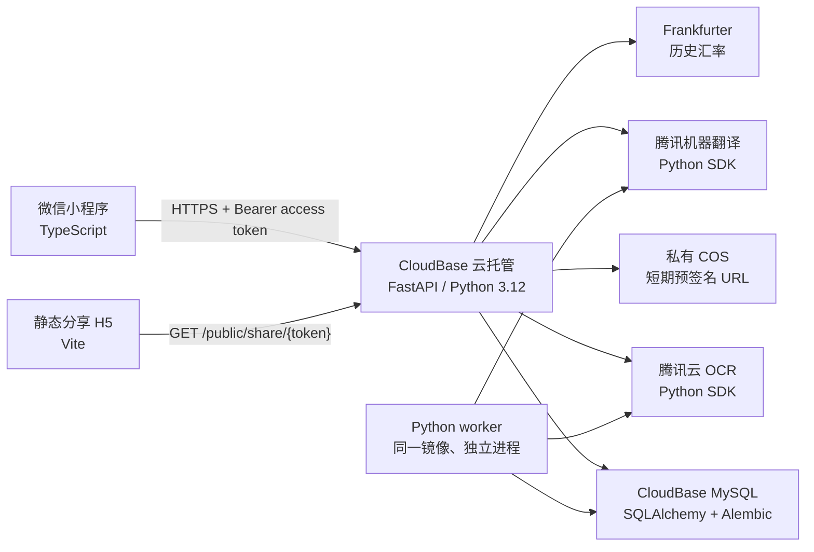

# 旅行自动分账：Python 后端技术方案（修订）

> 本文取代 [`2026-08-28-travel-split-billing-technical-design.md`](2026-08-28-travel-split-billing-technical-design.md) 中所有 Node.js 云函数、CloudBase 文档数据库和 TypeScript 后端任务。产品规则、数据保留规则、公开分享范围与验收场景保持不变。

**Goal:** 使用 Python 实现所有后端业务能力，同时保留原生微信小程序作为前端，实现准确、可审计的多人、多国家、多币种旅行分账。

**Architecture:** 小程序继续使用 TypeScript；Python 3.12 FastAPI 服务部署在 CloudBase 云托管（CloudBase Run），承载鉴权、REST API、OCR、翻译、汇率、分账计算和分享 API。权威业务数据迁移到 CloudBase MySQL；小票原图存入私有 COS，由 Python 服务签发单对象、短有效期上传/下载 URL。后台任务使用数据库 job 表与同一服务的 worker 进程，避免把业务逻辑拆回 Node.js。

**Tech Stack:** 微信小程序 TypeScript strict；Python 3.12；FastAPI；Pydantic v2；SQLAlchemy 2；Alembic；PyMySQL；`decimal.Decimal`；pytest；Hypothesis；httpx；腾讯云 Python SDK（OCR、机器翻译、STS）；COS Python SDK；Frankfurter v2；Vite TypeScript 分享 H5。

## 全局约束

- 后端业务逻辑、分账计算、数据访问、OCR、翻译、汇率、链接分享全部使用 Python；小程序与分享 H5 不包含业务计算真相。
- 金额在 API 与数据库中均是字符串十进制，Python 中只转换为 `decimal.Decimal`；禁止使用 `float`。
- MySQL `DECIMAL(24, 8)` 仅用于带索引的金额派生列；权威原始金额保存为 JSON 中的字符串，发布快照也保存为 JSON 字符串金额。
- 小程序仅调用 `/v1/*` HTTPS API，不直接读写 MySQL、COS、OCR 或翻译服务。
- COS 桶私有；每张图片的上传 URL 仅可 PUT 到单个预定 object key，5 分钟有效；下载 URL 只为 owner 签发，10 分钟有效。
- OAuth/登录态、数据库密码、COS 临时凭据和腾讯云密钥只在云托管 Secret/环境变量中可见，不能进入小程序、日志、Git 或分享投影。

## 1. 系统架构



### 为什么改为云托管而不是 Python 云函数

CloudBase 云函数可运行 Python，但 Python 服务端对 CloudBase 数据/存储的 SDK 与运行时集成不如 Node.js 路径直接。为保证“后端业务全部 Python”、使用成熟的 SQLAlchemy/Alembic 与可控的后台任务，本方案用 CloudBase 云托管运行容器化 FastAPI；CloudBase 云托管支持任意语言/框架的容器和 Python 快速开始。[官方说明](https://cloud.tencent.com/document/product/876/121989)

## 2. 身份认证与上传

### 2.1 小程序登录

1. 小程序调用 `wx.login()` 获取一次性 `code`，发送 `POST /v1/auth/wechat`。
2. FastAPI 在服务端调用微信 code2Session，得到稳定的 `openid`；不把 `openid` 返回给小程序。
3. 服务端签发 30 分钟有效的 JWT access token 和 30 天有效的随机 refresh token。refresh token 仅保存 SHA-256 哈希、所属用户、过期时间与撤销时间。
4. 所有私有 API 通过 `Authorization: Bearer <access-token>` 获得 owner 身份；路径或 payload 中的 owner 字段一律忽略。

### 2.2 图片直传

1. 小程序请求 `POST /v1/uploads`，提交 `trip_id`、JPEG mime type、字节数与 SHA-256。
2. 服务端验证 owner 和限制（最多 5 张/消费、单张压缩后不超过 10 MB），创建 `receipt_images` 记录和 COS object key：`receipts/{user_id}/{trip_id}/{image_id}.jpg`。
3. 服务端用 STS 最小权限或 COS SDK 生成该 object 的单次 PUT 预签名 URL；小程序上传后调用 `POST /v1/uploads/{image_id}/complete`。
4. 仅对象存在、Content-Type 为 JPEG 且 owner 一致时，图片才可被 `POST /v1/receipt-jobs` 引用。

腾讯 COS 支持使用预签名 URL 上传/下载对象，并建议使用临时密钥与最小权限。[官方文档](https://cloud.tencent.com/document/product/436/68284)

## 3. Python 项目结构

```text
backend/
  app/
    main.py                    # FastAPI app、middleware、路由注册
    api/v1/                    # auth、trips、expenses、uploads、jobs、settlements、shares
    domain/                    # dataclass/Pydantic 领域模型与业务错误
    core/                      # money.py、allocation.py、settlement.py、rates.py
    services/                  # receipt_service、share_service、idempotency_service
    repositories/              # SQLAlchemy repository；强制 owner_id 过滤
    providers/                 # tencent_ocr、tencent_tmt、frankfurter、cos_storage、wechat_auth
    db/                        # SQLAlchemy models、session、Alembic migrations
    worker/                    # job claim、receipt processor、retry policy
  tests/
    unit/                      # 金额、分摊、最少转账
    integration/               # API、权限、SQL、COS/provider fake
    e2e/                       # dev 环境端到端测试
  pyproject.toml
  Dockerfile
  alembic.ini
  alembic/versions/
miniprogram/
  services/api.ts              # fetch 封装、token 刷新、JSON 契约
  services/upload.ts           # 压缩、PUT 到预签名 URL、complete
share-web/
  src/                         # 只读 H5；不包含私有 API 或对象 URL
infra/cloudbase/
  cloudrun.yaml                # API 与 worker 的运行命令/环境变量名
  mysql.md                     # 实例、账号、迁移、备份
  cos-policy.json              # 最小权限 STS 策略
```

## 4. 数据库映射

原技术方案中的领域实体不变，改为关系型结构：

| 表 | 关键列 | 约束/索引 |
| --- | --- | --- |
| `users` | `id`, `wechat_openid_hash`, `created_at` | `wechat_openid_hash` 唯一；原始 openid 加密保存或不保存。 |
| `refresh_tokens` | `token_hash`, `user_id`, `expires_at`, `revoked_at` | `token_hash` 唯一；按 `user_id` 索引。 |
| `trips` | `id`, `owner_id`, `name`, `default_currency`, `latest_version_id` | `(owner_id, updated_at)` 索引。 |
| `participants` | `id`, `trip_id`, `display_name`, `is_owner` | `(trip_id, display_name)` 唯一。 |
| `expenses` | `id`, `trip_id`, `revision`, `status`, `occurred_at`, `payload_json` | `(trip_id, occurred_at)` 索引；payload 为 Pydantic 序列化 JSON。 |
| `receipt_images` | `id`, `owner_id`, `trip_id`, `object_key`, `status` | object key 唯一；不存可访问 URL。 |
| `receipt_jobs` | `id`, `expense_id`, `status`, `attempts`, `next_run_at` | `(status, next_run_at)` 索引，支持 worker 领取。 |
| `settlement_versions` | `id`, `trip_id`, `input_revision_map`, `result_json`, `public_json` | `(trip_id, created_at)` 索引；发布后不可更新。 |
| `share_links` | `token_hash`, `trip_id`, `expires_at`, `revoked_at` | `token_hash` 唯一。 |
| `idempotency_keys` | `user_id`, `key`, `response_json`, `expires_at` | `(user_id, key)` 唯一。 |

所有 owner 范围更新均使用 `WHERE id = :id AND owner_id = :owner_id`；未更新一行时对私有资源返回 `404`。更新 expense 必须加入 `AND revision = :expected_revision`，成功后 revision 加一。

## 5. 核心 Python 接口

```python
from decimal import Decimal
from pydantic import BaseModel, Field

class Money(BaseModel):
    currency: str = Field(pattern=r"^[A-Z]{3}$")
    amount: str = Field(pattern=r"^-?\d+(\.\d+)?$")

def as_decimal(money: Money) -> Decimal: ...
def quantize(money: Money) -> Money: ...
def allocate_amount(amount: Money, allocation: Allocation) -> dict[str, Money]: ...
def calculate_settlement(input: CalculateSettlementInput) -> SettlementResult: ...

class ReceiptOcrProvider(Protocol):
    async def recognize(self, image: bytes) -> RawReceiptOcr: ...

class ExchangeRateProvider(Protocol):
    async def quote(self, date: date, from_currency: str, to_currency: str) -> RateQuote: ...
```

`money.py` 只允许 `Decimal` 运算，内部精度设为 28；JPY/KRW 量化 0 位、CNY/USD/EUR 量化 2 位。`settlement.py` 必须与原方案第 5.1 节的分摊顺序一致，并返回每个调整、换算与尾差的审计行。

## 6. 异步 OCR 任务

- API 创建 job 后返回 `202 Accepted` 与 job ID；不在 HTTP 请求内等待 OCR。
- worker 用 `SELECT ... FOR UPDATE SKIP LOCKED` 领取一条 `queued/retryable` job，状态置为 `processing` 后处理；同一 job 只会被一个 worker 处理。
- 主识别使用购物小票类别；结果没有商品候选或低置信度时回退高精度通用 OCR。翻译失败只写警告，job 仍为 `needs_review`；OCR 两次失败才为 `failed`。
- 重试为指数退避：1 分钟、5 分钟、30 分钟，最多 3 次；不可重试的 4xx 配置/凭据错误直接失败并告警。
- worker 可与 API 共用同一 Docker 镜像，使用命令 `python -m app.worker.run` 独立部署为 CloudBase 云托管服务；不依赖内存中的 FastAPI BackgroundTasks。

## 7. API 变化

原 `action/payload` 云函数协议改为 REST，响应不变：成功 `{ "data": ... }`，失败 `{ "error": { "code", "message", "field_errors?" } }`。

| 方法与路径 | 作用 |
| --- | --- |
| `POST /v1/auth/wechat`、`POST /v1/auth/refresh` | 交换登录凭据；刷新 token。 |
| `GET/POST/PATCH /v1/trips` | 旅行账本和成员。 |
| `POST /v1/uploads`、`POST /v1/uploads/{id}/complete` | 获取上传 URL 与确认对象。 |
| `POST /v1/receipt-jobs`、`GET /v1/receipt-jobs/{id}` | 创建/查询 OCR job。 |
| `GET/POST/PATCH /v1/expenses` | 读取、手动创建、核对和带 revision 保存消费。 |
| `POST /v1/rates/quote` | 获取历史/手动汇率候选。 |
| `POST /v1/settlements/preview`、`POST /v1/settlements/publish` | 预览和不可变发布。 |
| `POST/DELETE /v1/share-links` | 创建、续期、撤销链接。 |
| `GET /public/share/{token}` | 匿名读取公开结算投影。 |

所有 mutation 接受 `Idempotency-Key` HTTP header；缺失或非法 UUID 返回 `400 IDEMPOTENCY_KEY_REQUIRED`。在数据库事务内保存响应后再返回，重试同 key 直接返回原响应。

## 8. 分阶段 Python 实施计划

### Task 1: FastAPI、SQLAlchemy 与迁移基础

**Files:** `backend/pyproject.toml`、`backend/app/main.py`、`backend/app/db/session.py`、`backend/alembic/`、`backend/tests/integration/test_health.py`。

- [ ] 写 `GET /healthz` 的 pytest 失败测试：`assert client.get('/healthz').json() == {'status': 'ok'}`。
- [ ] 运行 `uv run pytest backend/tests/integration/test_health.py -q`，确认因 app 不存在失败。
- [ ] 创建 Python 3.12 项目，安装 `fastapi`, `uvicorn`, `pydantic`, `sqlalchemy`, `pymysql`, `alembic`, `pytest`, `hypothesis`, `httpx`；实现 health endpoint 和数据库 session factory。
- [ ] 创建首个 Alembic migration，包含第 4 节全部表、唯一约束和索引；在 dev MySQL 执行 `uv run alembic upgrade head`。
- [ ] 运行 `uv run ruff check backend && uv run mypy backend && uv run pytest backend/tests -q`，期望 exit 0。

### Task 2: Decimal 分账核心与性质测试

**Files:** `backend/app/core/money.py`、`allocation.py`、`settlement.py`、`backend/tests/unit/test_settlement.py`。

- [ ] 写 JPY/CNY/KRW 量化、个人/公共优惠、后续退税、退款、三人最少转账的 pytest 测试，并以 Hypothesis 生成比例相加为 1 的随机分配。
- [ ] 运行 `uv run pytest backend/tests/unit/test_settlement.py -q`，确认 `calculate_settlement` 未定义。
- [ ] 仅用 `Decimal` 实现第 5 节接口；审计行必须包含 expense、参与人、金额、原因和汇率来源。
- [ ] 运行同一测试与 `uv run pytest backend/tests/unit -q`，期望所有断言通过，且每例最终净额和为零。

### Task 3: 微信认证、owner 范围仓储和幂等写入

**Files:** `backend/app/api/v1/auth.py`、`backend/app/api/dependencies.py`、`backend/app/repositories/`、`backend/tests/integration/test_ownership.py`。

- [ ] 写两用户越权读取同一 expense 返回 404、同一 `Idempotency-Key` 不创建两条消费的失败测试。
- [ ] 实现 `current_user` 依赖、JWT access token、哈希 refresh token、`owner_id` 强制过滤、revision 乐观锁和事务内幂等响应记录。
- [ ] 用 fake WeChat provider 跑集成测试；生产 provider 只在服务端访问小程序 app secret。
- [ ] 运行 `uv run pytest backend/tests/integration/test_ownership.py -q`，期望 exit 0。

### Task 4: COS 私有上传与 OCR worker

**Files:** `backend/app/providers/cos_storage.py`、`backend/app/providers/tencent_ocr.py`、`backend/app/worker/receipt_processor.py`、`backend/tests/integration/test_receipt_jobs.py`。

- [ ] 写“预签名 URL 只授权当前 object key、公开分享数据没有 object key”的失败测试。
- [ ] 实现上传申请/完成、对象 HEAD 校验、job 领取和三次重试；以 fake COS/OCR fixture 验证主识别、回退识别、翻译失败仍可人工确认。
- [ ] 运行 `uv run pytest backend/tests/integration/test_receipt_jobs.py -q`，期望 exit 0。

### Task 5: REST 账本、消费、汇率、结算与分享

**Files:** `backend/app/api/v1/trips.py`、`expenses.py`、`rates.py`、`settlements.py`、`shares.py`、`backend/tests/e2e/test_travel_settlement.py`。

- [ ] 写“日元小票 + 实际人民币扣款 + 发布 + 匿名链接”端到端失败测试；断言公开 JSON 无 `owner_id`、`openid`、`object_key`、`refresh_token`。
- [ ] 实现所有第 7 节 API；历史汇率保存 requested/effective 日期，实际扣款优先，未确认消费禁止发布。
- [ ] 使用 `secrets.token_urlsafe(32)` 生成分享 token，只存 SHA-256；过期/撤销/不存在统一返回 410。
- [ ] 运行 `uv run pytest backend/tests/e2e/test_travel_settlement.py -q`，期望 exit 0。

### Task 6: 小程序、H5、容器部署和验收

**Files:** `miniprogram/services/api.ts`、`miniprogram/services/upload.ts`、`share-web/`、`backend/Dockerfile`、`infra/cloudbase/cloudrun.yaml`、`docs/architecture/python-operations.md`。

- [ ] 将小程序 API 层替换为 REST token client，支持 401 刷新后单次重试；上传层仅使用后端签发的 PUT URL。
- [ ] H5 仅调用 `/public/share/{token}`，按公开投影渲染原文+中文翻译、税费/汇率说明与最少转账；不展示小票图片。
- [ ] 构建 Docker 镜像并部署 API/worker 两个云托管服务；配置 MySQL、COS、腾讯云 API、JWT 和微信密钥为 Secret，不写入镜像。
- [ ] 在 dev 环境执行 `uv run pytest backend/tests -q`、小程序真机上传/OCR/手动改账/链接过期验收；全部通过后才允许发布。

## 9. 迁移与实施决定

- 当前没有已实现的业务代码，因此不需要数据迁移；直接按本修订方案创建 Python 项目和 MySQL schema。
- 先实施 Task 1–3 打通“手动录入 + 精确分账”，再实施 Task 4 的 OCR/翻译；AI 服务不可用不能阻断分账闭环。
- 原计划中 `functions/`、`packages/core/`、`packages/adapters/`、`tests/functions/` 的路径全部废弃，替换为本文 `backend/` 路径；`miniprogram/`、`share-web/` 保留但其 API 调用改为 REST。
- 部署前复核 CloudBase 云托管计费、MySQL 规格、COS 跨地域设置、微信业务域名和 OCR/翻译服务配额。
