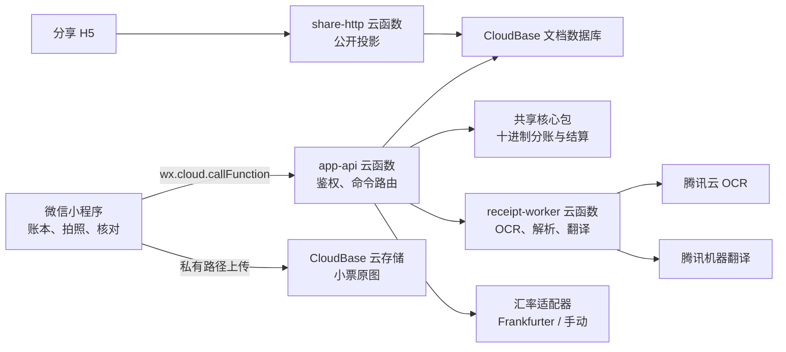

# 旅行自动分账微信小程序技术方案与实施计划

> **已由 Python 后端修订方案取代：** 请以 [`2026-08-28-travel-split-billing-python-backend-amendment.md`](2026-08-28-travel-split-billing-python-backend-amendment.md) 为后端实现依据。本文件保留产品规则与原始 Node.js 方案的决策记录，不应直接执行其中的后端任务。

> **For agentic workers:** REQUIRED SUB-SKILL: Use superpowers:subagent-driven-development (recommended) or superpowers:executing-plans to implement this plan task-by-task. Steps use checkbox (`- [ ]`) syntax for tracking.

**Goal:** 交付一个以微信小程序为客户端、CloudBase 为后端的可审计旅行分账 MVP，面向多人、多国家、多币种旅行，支持小票识别、人工核对、退税/退款和只读分享。

**Architecture:** 采用原生微信小程序与 CloudBase Serverless。小程序只负责交互、图片上传和展示；所有业务读写、鉴权和分账计算经云函数完成。把金额计算、分摊、汇率换算和最少转账算法放入共享 TypeScript 核心包，以纯函数和十进制金额保证可测试、可复算。OCR、翻译和汇率以端口（adapter）封装，业务模型不依赖某个供应商。

**Tech Stack:** 微信小程序原生框架 + TypeScript strict；CloudBase 云函数（Node.js 18.15 运行时）；CloudBase 文档型数据库与云存储；`@cloudbase/node-sdk`；`decimal.js`；`zod`；`ulid`；Vitest；腾讯云 OCR、腾讯机器翻译和 Frankfurter 历史汇率 API。

## Global Constraints

- 小程序基础库最低版本为 `2.2.3`；仅面向微信小程序，不为 iOS/Android 单独开发客户端。
- 云函数运行时固定为 `Node.js 18.15`；本地开发使用 Node.js `20 LTS` 与 TypeScript `5.x`。
- 所有业务金额以 ISO 4217 货币代码和字符串十进制值存储；禁止以 JavaScript `number` 持久化或结算。
- 结算金额保留到结算币种最小单位；尾差默认分配给付款人，并把尾差作为显式调整记录保存。
- 每笔消费只有一名付款人和一笔付款金额；多人责任通过商品/调整项的分摊规则产生。
- 实际扣款优先；只有没有实际扣款时，才使用消费日参考汇率或用户手动汇率。
- 只有云函数可以读写业务集合；客户端不直接查询数据库。云存储中的原图保持私有，分享页默认无原图。
- 用户身份只从云函数上下文读取；任何请求参数均不得决定 `ownerOpenId`。
- 分享令牌使用至少 256 位随机值，只存 SHA-256 哈希；已过期令牌只返回失效状态。
- OCR、翻译和汇率错误必须可见、可恢复到手动录入，不能伪造成功结果。
- 当前工作区未初始化 Git；实施开始后应先初始化私有仓库，再按每个任务完成点提交。

---

## 1. 技术选型与理由

| 领域 | 选择 | 理由 | 替换边界 |
| --- | --- | --- | --- |
| 客户端 | 原生微信小程序 + TypeScript | 相机、相册、微信登录、转发和云开发连接最短；第一版无需跨端抽象。 | `miniprogram/` 仅依赖 `shared/contracts`。 |
| 后端 | CloudBase 普通云函数 + 1 个 HTTP 分享函数 | 小程序、存储、数据库和函数原生联通；无需维护服务器。 | `functions/app-api` 只依赖核心包和仓储端口。 |
| 数据 | CloudBase 文档型数据库 | 旅行账本是小规模、以单用户读写为主的聚合数据；文档可自然保存商品与调整项快照。 | 仓储接口可替换为 MySQL/其他数据库。 |
| 金额引擎 | `decimal.js` 纯函数库 | 避免浮点误差，单元测试无需云环境。 | `packages/core` 无 CloudBase 依赖。 |
| OCR | 腾讯云通用票据识别（高级版），指定 `ShoppingReceipt=24`；失败时高精度通用 OCR | 已覆盖购物小票与海外发票等票据类型；回退保留原始文字。 | `ReceiptOcrProvider`。 |
| 翻译 | 腾讯机器翻译文本翻译 | 对日/英/韩到简体中文的商品文本批量翻译；原文永不覆盖。 | `TextTranslator`。 |
| 历史汇率 | Frankfurter v2（首选） | 提供按日历史汇率；返回有效报价日，适合“参考汇率估算”场景。 | `ExchangeRateProvider`，可改为商业数据源。 |
| 分享 | CloudBase 静态托管 H5 + HTTP 云函数 | 生成无需登录的 HTTPS 链接，适合微信中打开；小程序本身仍是编辑入口。 | `share-web/` 只消费公开投影 API。 |

### 非目标

- 不接入微信支付/银行卡，不读取真实扣款，不发起收款。
- 不实现离线同步、多人编辑、同行人认领或还款状态。
- 不把 OCR 结果视为会计凭证，也不提供税务建议。

## 2. 系统边界与数据流



### 2.1 录入小票

1. 小程序将经过压缩的 JPEG 上传至私有路径 `receipts/{openId}/{tripId}/{receiptId}/{imageId}.jpg`。
2. 小程序调用 `receipt.createJob`，仅提交 `tripId`、上传得到的 `fileIds` 与客户端生成的 `idempotencyKey`。
3. `app-api` 从上下文取 openId，验证账本所有权，创建 `receiptJobs`（`queued`）和空白 `expenses` 草稿。
4. `receipt-worker` 读取私有文件，先调用购物小票识别；无法取得可用商品候选时回退通用高精度 OCR。它保存供应商原始响应摘要、规范化文字块、解析出的项目候选与置信度。
5. Worker 对非中文商品文本批量翻译为简体中文，保存 `sourceText`、`translatedText`、`sourceLanguage` 与 `translationProvider`。
6. 小程序轮询 `receipt.getJob`；状态为 `needs_review` 时进入确认页。任何字段均可编辑，编辑后以人工值覆盖候选值，但不删除候选和原始响应引用。

### 2.2 金额与结算

1. `expense.saveDraft` 将商品、支付、调整项和税费以字符串十进制保存。
2. 若未填实际扣款，`rate.resolve` 通过消费日期请求参考汇率并记录 `requestedDate`、`effectiveDate`、来源、数值和估算标志；非报价日使用 API 返回的最近有效报价日并向用户展示。
3. `settlement.preview` 读取账本的所有有效消费/退款，调用核心包得到责任账、付款账、取整调整和最少转账集合。
4. `settlement.publish` 将当时的输入版本、计算结果和脱敏公开投影写成不可变 `settlementVersions`。后续修改只会使“最新发布版”过期，不会篡改历史版本。

### 2.3 分享

1. `share.create` 为账本生成或续期一个随机令牌的哈希记录；令牌关联账本而非单一版本，因此默认返回最新已发布版。
2. H5 使用 `GET /share/{token}` 获取公开投影；响应永不包含 `openId`、私有 `fileId`、原始 OCR 响应或未发布草稿。
3. 链接过期、撤销、账本不存在均返回同一个 `410 link_expired` 页面，避免探测数据。

## 3. 代码库结构

```text
miniprogram/
  app.ts                         # 云环境初始化与全局错误处理
  pages/trips/                   # 旅行列表、账本详情
  pages/expense/                 # 小票确认、手动消费、调整项
  pages/settlement/              # 预览、发布、长图导出
  services/api.ts                # 唯一的 callFunction 客户端
  services/upload.ts             # 图片压缩、私有路径上传
  stores/trip-draft.ts           # 页面临时编辑状态，不承载权威计算
  components/
share-web/
  src/main.ts                    # 只读 H5，解析 token 并请求公开 API
  src/pages/share-page.ts
  src/api/share-client.ts
functions/
  app-api/src/index.ts           # 命令白名单与统一错误映射
  app-api/src/handlers/          # trip、expense、receipt、rate、settlement、share 命令
  app-api/src/repositories/      # CloudBase 数据访问和所有权过滤
  receipt-worker/src/index.ts    # OCR、解析、翻译任务
  share-http/src/index.ts        # 公开 token 验证与投影响应
packages/
  contracts/src/                 # zod 请求/响应 schema 与 TypeScript 类型
  core/src/money.ts              # 十进制金额、货币精度与取整
  core/src/allocation.ts         # 商品、优惠、税/退税、附加项分摊
  core/src/settlement.ts         # 净额与最少转账
  core/src/rates.ts              # 参考汇率换算
  adapters/src/                  # OCR、翻译、汇率 provider 端口与实现
  fixtures/                      # 脱敏 OCR 响应和端到端账本样本
tests/
  core/                          # 纯函数单元与性质测试
  functions/                     # 命令/仓储/权限集成测试
  miniprogram/                   # 小程序页面模拟测试
infra/
  cloudbase/                     # 环境变量清单、索引、权限、部署说明
docs/
  architecture/                  # 数据字典、接口和运行手册
```

## 4. 数据设计

### 4.1 通用字段

每个私有文档都含有：`_id`、`ownerOpenId`、`createdAt`、`updatedAt`、`schemaVersion`。时间使用 ISO 8601 UTC 字符串；显示时转换为用户本地时区。所有变更命令带 `idempotencyKey`，成功响应保存在 `mutationReceipts` 24 小时，用同一 key 重试返回同一结果。

### 4.2 集合

| 集合 | 主键/索引 | 内容与不变量 |
| --- | --- | --- |
| `trips` | `_id`; `(ownerOpenId, updatedAt)` | `name`、`defaultSettlementCurrency`、`participantIds`、`latestPublishedVersionId`。仅 owner 可见。 |
| `participants` | `_id`; `(tripId, ownerOpenId)` | `displayName`、`isOwner`。至少一名且账本 owner 必须存在。 |
| `expenses` | `_id`; `(tripId, occurredAt)` | 支付、商品、税费、调整项、图片引用、`draft/reviewed/voided` 状态；只保存字符串金额。 |
| `receiptJobs` | `_id`; `(tripId, status, createdAt)` | 文件引用、处理状态、失败代码、候选值和原始响应摘要引用。 |
| `settlementVersions` | `_id`; `(tripId, createdAt)` | 输入的 `expenseRevisionMap`、不可变计算快照、`publicProjection`。 |
| `shareLinks` | `_id`; `tokenHash` 唯一 | `tripId`、`expiresAt`、`revokedAt`、`includeReceiptImages=false`。 |
| `mutationReceipts` | `(ownerOpenId, idempotencyKey)` 唯一 | 命令名、响应 JSON、过期时间。 |

### 4.3 `Expense` 关键结构

```ts
type DecimalString = string; // 正则：^-?\d+(\.\d+)?$

type Money = {
  currency: string;          // ISO 4217，例如 JPY/CNY/KRW
  amount: DecimalString;
};

type Allocation =
  | { mode: 'owner'; participantId: string }
  | { mode: 'equal'; participantIds: string[] }
  | { mode: 'ratio'; shares: Array<{ participantId: string; ratio: DecimalString }> };

type ExpenseLine = {
  id: string;
  sourceText: string;
  translatedText: string | null;
  quantity: DecimalString;
  unitPrice: Money;
  taxAmount: Money | null;
  allocation: Allocation;
  recognition: { confidence: DecimalString; source: 'ocr' | 'manual' };
};

type Adjustment = {
  id: string;
  kind: 'shared_discount' | 'personal_discount' | 'service_fee' | 'tip' |
        'shipping' | 'payment_fee' | 'rounding' | 'instant_tax_refund' | 'refund';
  amount: Money;
  allocation: Allocation | { mode: 'proportional_to_lines' };
  ownerParticipantId?: string;
};

type Payment = {
  payerParticipantId: string;
  receiptTotal: Money;
  actualPaid: Money | null;
  rate: {
    mode: 'actual_payment' | 'historical_reference' | 'manual';
    fromCurrency: string;
    toCurrency: string;
    rate: DecimalString | null;
    requestedDate: string | null;
    effectiveDate: string | null;
    provider: string | null;
  };
};
```

### 4.4 数据一致性

- `ratio` 分摊比例之和必须等于 `1`；`equal` 至少两人且不重复；商品归属必须属于同一 `tripId`。
- 含税、另计税、手填税额存为 `taxMode`，只在用户确认后进入 `reviewed`。
- 后续退税和退款是独立 `Expense`，其 `parentExpenseId` 指向原消费，金额可为负；后续退税使用 `kind='tax_refund_later'` 与按商品税额生成的分配快照。
- 删除原消费采用 `voided`，不物理删除历史结算引用；删除原始图片时单独删除私有对象并清除文件引用。

## 5. 计算核心与精度

### 5.1 计算顺序

1. 对每个商品计算 `quantity × unitPrice`；商品税额若另列则加入该商品责任。
2. 将个人优惠直接给指定人；公共优惠按商品责任金额比例扣减；服务费等调整项按它们自己的 `Allocation` 分配。
3. 后续退税按每人所购商品的 `taxAmount` 比例形成负向责任；税额缺失时阻止“按税额退税”发布，要求手动录入税额。
4. 对每个消费得到每名参与人的原始币种责任额；以实际扣款比例映射到支付币种/结算币种。实际付款不存在时使用保存的历史/手动汇率。
5. 每笔消费在目标币种量化，并将量化余数以 `rounding` 调整项给默认付款人或用户指定人。
6. 各人 `net = paid - responsible`。正数为应收、负数为应付。
7. 用两端指针匹配最大应收与最大应付，生成金额为两者绝对值较小者的转账，直到所有余额归零。这保证转账笔数最少在纯净额模型下。

### 5.2 必须实现的核心接口

```ts
export type CalculateSettlementInput = {
  settlementCurrency: string;
  participants: Array<{ id: string; name: string }>;
  expenses: ReviewedExpense[];
  roundingOwnerByExpenseId: Record<string, string>;
};

export type SettlementResult = {
  responsibilityByParticipant: Record<string, Money>;
  paidByParticipant: Record<string, Money>;
  netByParticipant: Record<string, Money>;
  transfers: Array<{ fromParticipantId: string; toParticipantId: string; amount: Money }>;
  auditLines: Array<{ expenseId: string; participantId: string; amount: Money; reason: string }>;
};

export function calculateSettlement(input: CalculateSettlementInput): SettlementResult;
export function allocateAmount(amount: Money, allocation: Allocation, participants: string[]): Record<string, Money>;
export function quantize(amount: Money, currency: string): Money;
```

### 5.3 币种精度

- 使用 ISO 4217 小数位元数据。MVP 内置 JPY=0、KRW=0、CNY=2、USD=2、EUR=2；遇到未知币种禁止发布，并允许在后续版本扩充表。
- `Decimal` 的中间精度不小于 20 位；仅在“每笔消费最终责任”和“最终转账”两个边界量化。
- 结算快照保存所有量化前后值与尾差，确保日后能解释人民币分/日元整数的差异。

## 6. 云函数 API

所有私有命令统一由 `app-api` 接收。请求包络为 `{ action, payload, idempotencyKey }`；响应包络为 `{ ok: true, data }` 或 `{ ok: false, error: { code, message, fieldErrors? } }`。`zod` 在路由入口验证 payload；未知 action 返回 `NOT_FOUND`。

| action | payload | 成功响应 | 失败/鉴权 |
| --- | --- | --- | --- |
| `trip.create` | `name`, `defaultSettlementCurrency`, `participants[]` | `Trip` | 名称空、币种不支持 |
| `trip.list` | 无 | `TripSummary[]` | 仅返回上下文 openId 的账本 |
| `trip.update` | `tripId`, 可更新字段 | `Trip` | 非 owner 返回 `FORBIDDEN` |
| `expense.createDraft` | `tripId`, `fileIds[]?` | `expenseId`, `receiptJobId?` | 文件路径非当前 openId 返回 `FORBIDDEN` |
| `expense.get` | `expenseId` | `Expense` | 非 owner 返回 `NOT_FOUND` |
| `expense.saveDraft` | `expenseId`, `revision`, `ExpenseDraft` | `Expense` | 版本冲突返回 `CONFLICT` |
| `receipt.getJob` | `receiptJobId` | `ReceiptJob` | 非 owner 返回 `NOT_FOUND` |
| `rate.resolve` | `date`, `fromCurrency`, `toCurrency` | `RateQuote` | 无报价返回 `RATE_UNAVAILABLE` |
| `settlement.preview` | `tripId`, `settlementCurrency` | `SettlementResult` | 未审核消费返回 `REVIEW_REQUIRED` |
| `settlement.publish` | `tripId`, `settlementCurrency` | `SettlementVersion` | 重算后发布，失败返回字段错误 |
| `share.create` | `tripId`, `expiresAt` | `{ url, expiresAt }` | 过期时间不合法、非 owner |
| `share.revoke` | `tripId` | `{ revoked: true }` | 非 owner |

`share-http` 只接受 `GET /share/:token`，以 `Cache-Control: no-store` 返回公开投影 JSON；H5 处理渲染。请求频率限制：每 IP 每分钟 60 次，令牌连续 10 次无效请求后 10 分钟降速。

## 7. 第三方适配层

```ts
export interface ReceiptOcrProvider {
  recognize(input: { imageBytes: Uint8Array; hint: 'shopping_receipt' }): Promise<RawReceiptOcr>;
}

export interface TextTranslator {
  translate(input: { texts: string[]; sourceLanguage: string | 'auto'; targetLanguage: 'zh' }): Promise<TranslatedText[]>;
}

export interface ExchangeRateProvider {
  quote(input: { date: string; fromCurrency: string; toCurrency: string }): Promise<{
    rate: DecimalString;
    requestedDate: string;
    effectiveDate: string;
    provider: string;
  }>;
}
```

- `TencentReceiptOcrProvider`：优先请求通用票据识别高级版，类型为 `ShoppingReceipt=24`；解析器将供应商字段转成与产品无关的 `RawReceiptOcr`。
- `TencentGeneralOcrProvider`：主识别失败/项目为空时回退，仅产出文字块与位置；`ReceiptParser` 根据金额、数量、合计、税行模式生成“候选”而非事实。
- `TencentTranslator`：按消费批次翻译，去重相同 `sourceText`；翻译失败时保留原文、写入警告，不阻塞人工保存。
- `FrankfurterRateProvider`：请求指定日期，记录真实 `effectiveDate`；外部错误、没有币种或交叉计算失败时返回 `RATE_UNAVAILABLE`。`ManualRateProvider` 始终可用，需用户输入正数率。
- 所有供应商凭据只保存在 CloudBase 环境变量/服务角色中；客户端包、数据库文档、日志和分享投影不得出现密钥或完整原图 URL。

## 8. 安全、隐私与运行

### 身份与授权

- 调用每个私有云函数时从 CloudBase 上下文读取 openId；仓储查询恒定加入 `{ ownerOpenId: context.openId }`。
- `tripId`、`expenseId`、`receiptJobId`、`shareLinkId` 都先经 owner 范围查询再操作。对不可见私有资源返回 `NOT_FOUND`，不区分不存在和无权限。
- 数据库客户端权限设为拒绝；云函数服务身份具备集合最小读写权限。云存储设为私有，上传路径用服务端验证过的 trip 与 openId。

### 数据最小化

- 原图默认长期保存于私有存储；用户删除图片时删除对象并置空引用。OCR 原始响应仅保存必要审计字段，保留期为 90 天后删除；规范化结果保留至消费删除。
- 分享投影只含参与人显示名、已发布明细、翻译、金额、汇率/税费说明；默认不含原图和支付凭证。
- 日志使用 `requestId`、资源 ID 和错误码；不写小票全文、令牌、openId、支付金额明细或授权头。

### 可观测性

- 每个云函数生成/透传 `requestId`，结构化记录 `action`、耗时、结果码、provider、重试次数。
- 告警：OCR/翻译失败率 15 分钟内 >10%、汇率失败率 >5%、函数 P95 >8 秒、`share-http` 5xx >1%。
- 生产环境禁用调试响应；错误映射表仅输出产品可读的中文提示和稳定代码。

## 9. 实施任务

### Task 1: 初始化 monorepo 与 CloudBase 最小环境

**Files:**
- Create: `package.json`
- Create: `pnpm-workspace.yaml`
- Create: `tsconfig.base.json`
- Create: `project.config.json`
- Create: `miniprogram/app.ts`
- Create: `infra/cloudbase/README.md`
- Create: `infra/cloudbase/indexes.md`
- Test: `packages/contracts/src/health.test.ts`

**Interfaces:**
- Produces: 共享包别名 `@money/contracts`、`@money/core`、`@money/adapters`；CloudBase 环境 ID 通过未提交的 `miniprogram/env.local.ts` 提供。

- [ ] **Step 1: 写失败的 workspace 解析测试。**

```ts
import { describe, expect, it } from 'vitest';
import { HealthSchema } from './health';

describe('HealthSchema', () => {
  it('accepts the API health payload', () => {
    expect(HealthSchema.parse({ ok: true, service: 'app-api' }))
      .toEqual({ ok: true, service: 'app-api' });
  });
});
```

- [ ] **Step 2: 运行测试确认失败。**

Run: `pnpm vitest packages/contracts/src/health.test.ts --run`

Expected: FAIL，原因是 `./health` 尚不存在。

- [ ] **Step 3: 建立 pnpm workspace、TypeScript strict 和健康契约。**

```ts
// packages/contracts/src/health.ts
import { z } from 'zod';
export const HealthSchema = z.object({ ok: z.literal(true), service: z.literal('app-api') });
export type Health = z.infer<typeof HealthSchema>;
```

`tsconfig.base.json` 必须启用 `strict: true`、`noUncheckedIndexedAccess: true`、`exactOptionalPropertyTypes: true`；`project.config.json` 的 `miniprogramRoot` 固定为 `miniprogram/`。

- [ ] **Step 4: 初始化 CloudBase 环境并记录索引/权限基线。**

在 `infra/cloudbase/README.md` 写入环境创建、私有数据库规则、私有存储、函数日志和部署前检查；在 `indexes.md` 明确第 4.2 节的索引。环境 ID 和任何密钥只能放 `env.local.ts`/控制台环境变量，均加入 `.gitignore`。

- [ ] **Step 5: 运行静态检查。**

Run: `pnpm lint && pnpm typecheck && pnpm vitest --run`

Expected: exit 0。

### Task 2: 定义共享契约、金额类型与货币精度

**Files:**
- Create: `packages/contracts/src/commands.ts`
- Create: `packages/contracts/src/domain.ts`
- Create: `packages/core/src/money.ts`
- Create: `packages/core/src/money.test.ts`

**Interfaces:**
- Consumes: `@money/contracts` workspace。
- Produces: `MoneySchema`、`AllocationSchema`、`quantize()`、`currencyScale()`，供所有 handler 与计算器使用。

- [ ] **Step 1: 写失败的货币精度测试。**

```ts
it.each([
  ['JPY', '12.6', '13'],
  ['KRW', '12.4', '12'],
  ['CNY', '12.345', '12.35'],
])('quantizes %s with its ISO scale', (currency, amount, expected) => {
  expect(quantize({ currency, amount }).amount).toBe(expected);
});
```

- [ ] **Step 2: 运行失败测试。**

Run: `pnpm vitest packages/core/src/money.test.ts --run`

Expected: FAIL，原因是 `quantize` 未定义。

- [ ] **Step 3: 用 `decimal.js` 实现不可变金额。**

```ts
export const CURRENCY_SCALE: Readonly<Record<string, number>> = { JPY: 0, KRW: 0, CNY: 2, USD: 2, EUR: 2 };
export function quantize(money: Money): Money {
  const scale = CURRENCY_SCALE[money.currency];
  if (scale === undefined) throw new DomainError('UNSUPPORTED_CURRENCY', money.currency);
  return { ...money, amount: new Decimal(money.amount).toDecimalPlaces(scale, Decimal.ROUND_HALF_UP).toFixed(scale) };
}
```

- [ ] **Step 4: 定义并验证命令包络和领域 schema。**

```ts
export const CommandEnvelopeSchema = z.object({
  action: z.string().min(1),
  idempotencyKey: z.string().uuid(),
  payload: z.unknown(),
});
```

为 `Money`、`Allocation`、`ExpenseLine`、`Adjustment`、`Payment` 和错误响应写 zod schema，拒绝非字符串金额、未知币种和比例不为 1 的分摊。

- [ ] **Step 5: 运行测试、类型检查。**

Run: `pnpm vitest packages/core/src/money.test.ts --run && pnpm typecheck`

Expected: exit 0。

### Task 3: 实现可审计的分摊与结算核心

**Files:**
- Create: `packages/core/src/allocation.ts`
- Create: `packages/core/src/settlement.ts`
- Create: `packages/core/src/settlement.test.ts`
- Create: `packages/fixtures/src/japan-two-person.ts`

**Interfaces:**
- Consumes: `Money`、`Allocation`、`quantize`。
- Produces: `calculateSettlement(input): SettlementResult` 和带原因的 `auditLines`。

- [ ] **Step 1: 为“日元小票、人民币实际扣款、个人券、公共优惠”写失败测试。**

```ts
it('allocates personal and shared discounts before mapping to actual CNY payment', () => {
  const result = calculateSettlement(japanTwoPersonFixture);
  expect(result.netByParticipant.friend.amount).toBe('-168.42');
  expect(result.netByParticipant.owner.amount).toBe('168.42');
  expect(result.transfers).toEqual([{ fromParticipantId: 'friend', toParticipantId: 'owner', amount: { currency: 'CNY', amount: '168.42' } }]);
});
```

- [ ] **Step 2: 运行失败测试。**

Run: `pnpm vitest packages/core/src/settlement.test.ts --run`

Expected: FAIL，原因是计算器尚不存在。

- [ ] **Step 3: 按第 5.1 节顺序实现分摊。**

实现 `allocateAmount`、`allocateProportionalToLines`、`applyAdjustments`、`mapToSettlementCurrency`、`minimizeTransfers`。每个阶段都输出 `AuditLine`，禁止在中间步骤量化；只有消费责任和最终转账调用 `quantize`。

- [ ] **Step 4: 增加退税、退款、三人互相代付与尾差测试。**

```ts
it('routes later tax refund by item tax rather than order total', () => {
  const result = calculateSettlement(laterTaxRefundFixture);
  expect(result.auditLines.filter(x => x.reason === 'later_tax_refund')).toHaveLength(2);
});

it('produces two transfers for a three-person netting cycle', () => {
  expect(calculateSettlement(threePayerFixture).transfers).toHaveLength(2);
});
```

- [ ] **Step 5: 运行核心包测试。**

Run: `pnpm vitest packages/core --run`

Expected: exit 0，覆盖所有验收场景的金额规则。

### Task 4: 建立 CloudBase 仓储、所有权过滤和幂等命令

**Files:**
- Create: `functions/app-api/src/context.ts`
- Create: `functions/app-api/src/repositories/trip-repository.ts`
- Create: `functions/app-api/src/repositories/expense-repository.ts`
- Create: `functions/app-api/src/repositories/mutation-receipt-repository.ts`
- Create: `functions/app-api/src/services/idempotency.ts`
- Create: `tests/functions/ownership.test.ts`

**Interfaces:**
- Consumes: CloudBase 服务端 SDK、共享 domain schema。
- Produces: `OwnerScopedRepository` 和 `runIdempotent(openId, key, command, fn)`。

- [ ] **Step 1: 写跨用户访问的失败集成测试。**

```ts
it('returns NOT_FOUND when another openId requests an expense', async () => {
  await seedExpense({ ownerOpenId: 'owner-a', id: 'expense-1' });
  await expect(getExpense({ openId: 'owner-b' }, 'expense-1')).rejects.toMatchObject({ code: 'NOT_FOUND' });
});
```

- [ ] **Step 2: 运行失败测试。**

Run: `pnpm vitest tests/functions/ownership.test.ts --run`

Expected: FAIL，原因是仓储尚不存在。

- [ ] **Step 3: 实现 owner 范围仓储。**

所有读取以 `{ _id: id, ownerOpenId: openId }` 查询；更新和软删除使用同一筛选条件。`runIdempotent` 先查 `(openId, idempotencyKey)`，命中则返回保存响应，未命中才执行命令并原子写回响应。

- [ ] **Step 4: 加入并发修改保护。**

`expense.saveDraft` 必须带 `revision`；更新条件包含旧 revision，未命中返回 `CONFLICT`，成功时 revision 加 1。

- [ ] **Step 5: 运行函数测试。**

Run: `pnpm vitest tests/functions --run`

Expected: exit 0，含越权、幂等重试和 revision 冲突。

### Task 5: 实现私有命令路由与旅行/消费 CRUD

**Files:**
- Create: `functions/app-api/src/index.ts`
- Create: `functions/app-api/src/router.ts`
- Create: `functions/app-api/src/handlers/trip.ts`
- Create: `functions/app-api/src/handlers/expense.ts`
- Create: `functions/app-api/src/errors.ts`
- Create: `tests/functions/router.test.ts`

**Interfaces:**
- Consumes: OwnerScopedRepository、CommandEnvelopeSchema。
- Produces: `main(event, context)`；支持 `trip.*` 和 `expense.*` 命令。

- [ ] **Step 1: 写未知命令的失败测试。**

```ts
it('maps an unknown action to stable NOT_FOUND error', async () => {
  await expect(invoke({ action: 'trip.eraseWorld', idempotencyKey: crypto.randomUUID(), payload: {} }))
    .resolves.toEqual({ ok: false, error: { code: 'NOT_FOUND', message: '未找到该操作' } });
});
```

- [ ] **Step 2: 运行失败测试。**

Run: `pnpm vitest tests/functions/router.test.ts --run`

Expected: FAIL，原因是路由入口尚不存在。

- [ ] **Step 3: 实现动作白名单与统一错误映射。**

```ts
const handlers: Record<Action, Handler> = {
  'trip.create': createTrip,
  'trip.list': listTrips,
  'trip.update': updateTrip,
  'expense.createDraft': createExpenseDraft,
  'expense.get': getExpense,
  'expense.saveDraft': saveExpenseDraft,
};
```

入口先构造 `RequestContext`，后验证命令，最后通过 `runIdempotent` 执行变更；仅将 `DomainError` 映射为稳定中文文案，其他错误记录 requestId 后返回 `INTERNAL_ERROR`。

- [ ] **Step 4: 为每条私有命令添加契约测试。**

覆盖空旅行名、参与人重复、比例不为 1、非 owner、未知 currency、过期 revision 和重复 idempotencyKey。

- [ ] **Step 5: 运行测试与本地函数 smoke test。**

Run: `pnpm vitest tests/functions --run && pnpm --filter app-api typecheck`

Expected: exit 0。

### Task 6: 接入 OCR、翻译和确认任务

**Files:**
- Create: `packages/adapters/src/ocr/tencent-receipt-ocr.ts`
- Create: `packages/adapters/src/ocr/receipt-parser.ts`
- Create: `packages/adapters/src/translation/tencent-translator.ts`
- Create: `functions/receipt-worker/src/index.ts`
- Create: `functions/app-api/src/handlers/receipt.ts`
- Create: `tests/functions/receipt-worker.test.ts`
- Create: `packages/fixtures/src/ocr/japan-receipt.json`

**Interfaces:**
- Consumes: 私有 `fileId`、`ReceiptOcrProvider`、`TextTranslator`。
- Produces: `ReceiptJob` 状态机 `queued → processing → needs_review | failed`。

- [ ] **Step 1: 用脱敏 OCR fixture 写失败的解析测试。**

```ts
it('extracts candidate items, total, JPY, and a tax line from a Japanese receipt', () => {
  const parsed = parseReceipt(japanReceiptOcrFixture);
  expect(parsed.currencyCandidate).toBe('JPY');
  expect(parsed.lineCandidates).toHaveLength(5);
  expect(parsed.totalCandidate?.amount).toBe('12480');
});
```

- [ ] **Step 2: 运行失败测试。**

Run: `pnpm vitest tests/functions/receipt-worker.test.ts --run`

Expected: FAIL，原因是解析器和 worker 尚不存在。

- [ ] **Step 3: 实现 provider、回退和状态机。**

主 provider 传递 `ShoppingReceipt=24`；若请求失败、无商品候选或置信度低于 `0.60`，调用通用高精度 OCR。解析器仅产生候选和置信度；不得把 OCR 结果直接标记为 `reviewed`。同一 `sourceText` 在单 job 内只翻译一次。

- [ ] **Step 4: 实现失败可恢复行为。**

OCR 失败将 job 标为 `failed`，保留图片和错误码；翻译失败仍标为 `needs_review`，在字段上保留原文与 `translationWarning=true`。

- [ ] **Step 5: 运行测试与 provider mock 集成测试。**

Run: `pnpm vitest tests/functions/receipt-worker.test.ts --run`

Expected: exit 0，覆盖主 OCR、回退、翻译失败和手动继续。

### Task 7: 接入历史/手动汇率与结算发布

**Files:**
- Create: `packages/adapters/src/rates/frankfurter-rate-provider.ts`
- Create: `functions/app-api/src/handlers/rate.ts`
- Create: `functions/app-api/src/handlers/settlement.ts`
- Create: `functions/app-api/src/repositories/settlement-repository.ts`
- Create: `tests/functions/settlement-publish.test.ts`

**Interfaces:**
- Consumes: `ExchangeRateProvider`、`calculateSettlement`、已审核 expenses。
- Produces: `RateQuote`、不可变 `SettlementVersion` 与 trip 的 `latestPublishedVersionId`。

- [ ] **Step 1: 写“周末引用前一报价日”的失败测试。**

```ts
it('stores provider effectiveDate instead of pretending a weekend quote exists', async () => {
  mockRateProvider.quote.mockResolvedValue({ rate: '0.0497', requestedDate: '2026-08-15', effectiveDate: '2026-08-14', provider: 'frankfurter' });
  expect((await resolveRate({ date: '2026-08-15', fromCurrency: 'JPY', toCurrency: 'CNY' })).effectiveDate).toBe('2026-08-14');
});
```

- [ ] **Step 2: 运行失败测试。**

Run: `pnpm vitest tests/functions/settlement-publish.test.ts --run`

Expected: FAIL，原因是 rate handler 和发布逻辑尚不存在。

- [ ] **Step 3: 实现汇率适配与手动覆盖。**

`rate.resolve` 不修改消费；`expense.saveDraft` 显式选择 `historical_reference` 或 `manual` 并保存完整 quote。`actual_payment` 模式不调用外部汇率。外部汇率不可用时返回 `RATE_UNAVAILABLE`，确认页展示手动汇率入口。

- [ ] **Step 4: 实现 preview 和不可变发布。**

`settlement.preview` 调用核心计算器但不写库；`settlement.publish` 重算、保存 `expenseRevisionMap`/完整结果/公开投影，再在同一事务中更新 `latestPublishedVersionId`。存在任何 `draft` 消费时返回 `REVIEW_REQUIRED`。

- [ ] **Step 5: 运行发布测试。**

Run: `pnpm vitest tests/functions/settlement-publish.test.ts --run`

Expected: exit 0，覆盖实际付款优先、历史汇率、手动汇率、未确认拦截和发布快照不可变。

### Task 8: 实现安全的分享链接与只读 H5

**Files:**
- Create: `functions/app-api/src/handlers/share.ts`
- Create: `functions/share-http/src/index.ts`
- Create: `share-web/src/main.ts`
- Create: `share-web/src/pages/share-page.ts`
- Create: `tests/functions/share.test.ts`

**Interfaces:**
- Consumes: `SettlementVersion.publicProjection`、`ShareLink`。
- Produces: owner 可创建的 URL；匿名只读公开投影。

- [ ] **Step 1: 写分享投影泄露检查的失败测试。**

```ts
it('never returns private storage ids or owner identity in a public response', async () => {
  const response = await getPublicShare(validToken);
  expect(JSON.stringify(response)).not.toMatch(/openId|fileId|receiptJobs/);
  expect(response.status).toBe(200);
});
```

- [ ] **Step 2: 运行失败测试。**

Run: `pnpm vitest tests/functions/share.test.ts --run`

Expected: FAIL，原因是公开 handler 尚不存在。

- [ ] **Step 3: 实现令牌、过期和撤销。**

使用 `crypto.randomBytes(32)` 生成 URL-safe token，数据库只存 `sha256(token)`。token 对应 trip；读请求取 `latestPublishedVersionId`。链接失效、撤销或不存在时统一返回 `410 link_expired`。

- [ ] **Step 4: 实现最小 H5 分享页。**

展示版本时间、每人应收应付、转账建议、商品原文+中文翻译、汇率/优惠/税费说明。页面不得请求私有 API，不渲染原图，给所有展示文本做 HTML 转义。

- [ ] **Step 5: 运行安全与 H5 测试。**

Run: `pnpm vitest tests/functions/share.test.ts --run && pnpm --filter share-web build`

Expected: exit 0。

### Task 9: 构建小程序账本、上传与确认页

**Files:**
- Create: `miniprogram/services/api.ts`
- Create: `miniprogram/services/upload.ts`
- Create: `miniprogram/pages/trips/index.ts`
- Create: `miniprogram/pages/trip-detail/index.ts`
- Create: `miniprogram/pages/expense-confirm/index.ts`
- Create: `miniprogram/components/allocation-editor/index.ts`
- Create: `tests/miniprogram/expense-confirm.test.ts`

**Interfaces:**
- Consumes: 私有 app-api 契约；`expense.createDraft`、`receipt.getJob`、`expense.saveDraft`。
- Produces: 用户可编辑的消费草稿，保存前由 zod schema 验证。

- [ ] **Step 1: 写确认页的失败测试。**

```ts
it('keeps an OCR candidate editable and blocks save when ratio shares are not one', async () => {
  const page = await renderExpenseConfirm(receiptJobFixture);
  await page.setRatio('friend', '0.4');
  await expect(page.tapSave()).rejects.toThrow('分摊比例之和必须为 1');
});
```

- [ ] **Step 2: 运行失败测试。**

Run: `pnpm vitest tests/miniprogram/expense-confirm.test.ts --run`

Expected: FAIL，原因是页面和分摊编辑器尚不存在。

- [ ] **Step 3: 实现唯一 API 客户端与私有上传。**

`services/api.ts` 只暴露已定义 action；每次 mutation 生成 UUID idempotencyKey。`upload.ts` 调用 `wx.compressImage` 后上传到 owner/trip/receipt 路径，上传成功再请求 `expense.createDraft`；失败不创建无法引用的消费。

- [ ] **Step 4: 实现确认和手动录入。**

确认页显示原文、中文翻译、置信度警告、商品/税费/合计候选。允许新增/删除商品，选择单人、均分、比例，填写实际扣款、汇率模式、优惠和附加项。不能从 UI 直接计算最终金额，只展示预览 API 结果。

- [ ] **Step 5: 运行小程序模拟测试与开发者工具手测。**

Run: `pnpm vitest tests/miniprogram --run`

Expected: exit 0。

手测：拍照、相册多选、OCR 失败转手动、日元实际人民币扣款、比例错误提示、重复点保存只创建一次消费。

### Task 10: 构建结算、发布与长图页面

**Files:**
- Create: `miniprogram/pages/settlement/index.ts`
- Create: `miniprogram/pages/settlement/long-image.ts`
- Create: `miniprogram/components/transfer-list/index.ts`
- Create: `miniprogram/components/audit-drawer/index.ts`
- Create: `tests/miniprogram/settlement.test.ts`

**Interfaces:**
- Consumes: `settlement.preview`、`settlement.publish`、`share.create`。
- Produces: 结算预览、可追溯转账建议、PNG 长图、有效期链接。

- [ ] **Step 1: 写发布前未确认消费提示的失败测试。**

```ts
it('shows review-required items instead of publishing an incomplete settlement', async () => {
  mockPreview({ ok: false, error: { code: 'REVIEW_REQUIRED', message: '请先确认 1 笔消费' } });
  const page = await renderSettlement();
  expect(await page.tapPublish()).toContain('请先确认 1 笔消费');
});
```

- [ ] **Step 2: 运行失败测试。**

Run: `pnpm vitest tests/miniprogram/settlement.test.ts --run`

Expected: FAIL，原因是结算页尚不存在。

- [ ] **Step 3: 实现预览与审计展开。**

以结算币种显示责任、已付、净额和最少转账；每笔转账可展开 `auditLines`。显示“实际扣款/历史估算/手动汇率”及有效报价日；尾差单独标为“尾差调整”。

- [ ] **Step 4: 实现发布、有效期和长图。**

发布仅在成功后更新当前 UI 版本。长图从 `SettlementResult` 的公开投影绘制，不包含图片或私有 ID；生成后用 `wx.saveImageToPhotosAlbum` 和微信转发入口。链接有效期默认 7 天，允许用户选择 1、7、30 天。

- [ ] **Step 5: 运行测试。**

Run: `pnpm vitest tests/miniprogram/settlement.test.ts --run`

Expected: exit 0。

### Task 11: 部署、监控、验收与安全回归

**Files:**
- Create: `infra/cloudbase/deploy.md`
- Create: `infra/cloudbase/monitoring.md`
- Create: `docs/architecture/data-retention.md`
- Create: `tests/e2e/travel-settlement.e2e.ts`
- Create: `docs/acceptance/mvp-checklist.md`

**Interfaces:**
- Consumes: 全部已部署函数、开发环境 CloudBase。
- Produces: 可重复部署步骤、监控阈值、MVP 验收证据。

- [ ] **Step 1: 写端到端失败测试样本。**

```ts
it('completes a two-person JPY receipt through published CNY share projection', async () => {
  const trip = await api.createTrip(twoPeople);
  const expense = await api.createReviewedExpense(trip.id, japanTwoPersonFixture);
  const version = await api.publishSettlement(trip.id, 'CNY');
  const publicPage = await api.getShare(await api.createShare(trip.id, sevenDaysFromNow));
  expect(publicPage.transfers[0].amount).toEqual({ currency: 'CNY', amount: '168.42' });
  expect(JSON.stringify(publicPage)).not.toContain('fileId');
});
```

- [ ] **Step 2: 运行失败测试。**

Run: `pnpm vitest tests/e2e/travel-settlement.e2e.ts --run`

Expected: FAIL，原因是本地/测试 CloudBase 环境尚未部署完整函数。

- [ ] **Step 3: 写部署与安全清单。**

`deploy.md` 必须依次覆盖：创建 dev/prod 环境、设置 CAM 最小权限、设置函数环境变量、创建索引、部署函数/H5/小程序、在控制台验证私有数据库/存储规则、设置告警。`data-retention.md` 固化第 8 节的保留与删除策略。

- [ ] **Step 4: 部署 dev 并运行端到端与人工验收。**

Run: `pnpm test:e2e -- --env=dev`

Expected: exit 0。

人工验收依次覆盖：日/英/韩小票、手动录入、两/三人分摊、个人/公共优惠、即时/后续退税、退款、实际/历史/手动汇率、尾差、发布版本、链接过期和撤销、OCR/翻译/汇率失败恢复、越权访问。

- [ ] **Step 5: 发布前检查。**

Run: `pnpm lint && pnpm typecheck && pnpm test && pnpm test:e2e -- --env=dev`

Expected: 所有命令 exit 0；监控面板可见函数调用、错误率和 OCR/汇率 provider 指标。

## 10. 测试策略

| 层级 | 目标 | 代表用例 |
| --- | --- | --- |
| 核心单元测试 | 每一分金额可复算 | JPY/CNY/KRW 精度、比例、个人券、公共优惠、税额退税、退款、尾差、三人净额。 |
| 核心性质测试 | 防止组合爆炸 | 所有参与人责任额之和等于每笔消费实际责任总额；转账总额收支相等；量化后净额和为 0。 |
| 函数契约测试 | 输入与权限边界 | zod 拒绝非法金额/比例；openId 越权为 NOT_FOUND；幂等 key 重放不重复写入。 |
| Provider mock 测试 | 外部失败可恢复 | OCR 回退、翻译失败、周末汇率有效日、手动汇率。 |
| 小程序模拟 | 关键核对体验 | 修改 OCR 字段、比例编辑、保存冲突、发布前拦截。 |
| E2E | 真实用户闭环 | 建账本→录入→确认→结算→发布→匿名分享；公开响应无私有字段。 |

## 11. 发布顺序与风险控制

1. 先以纯手动录入 + 核心结算器打通闭环，再上线 OCR/翻译；任何 AI 服务故障不应妨碍分账。
2. 在 dev 环境用脱敏小票 fixture 验证主/回退识别；生产调用先使用低额度和失败告警。
3. 汇率仅用于估算，UI 始终展示来源/有效日期并提供手动覆盖；实际扣款一旦录入，必须显著替代估算。
4. 分享功能在安全回归通过后才开启；先验证私有文件无法通过公开 token 访问。
5. 第一版不打开直接数据库客户端权限；以后若为性能开放读取，也必须保持 owner 规则和集成测试。

## 12. 外部能力依据（实施前复核）

- [CloudBase 小程序端 SDK](https://cloud.tencent.com/document/product/876/19385)：小程序框架内置云开发 SDK，基础库要求至少 2.2.3。
- [CloudBase 云函数](https://cloud.tencent.com/document/product/876/46899)：支持 SDK 调用、HTTP 调用、定时触发与 Node.js 等运行时；函数同步请求上限及资源限制需在部署时复核。
- [腾讯云通用票据识别（高级版）](https://cloud.tencent.com/document/product/866/90802)：含 `ShoppingReceipt`（购物小票）与海外发票类别。
- [腾讯云通用文字识别](https://cloud.tencent.com/product/generalocr)：支持日语、英语、韩语等多语种；只作为购物小票识别的回退。
- [腾讯机器翻译](https://cloud.tencent.com/document/product/551/7372)：提供中文、英语、日语、韩语等语言翻译能力。
- [Frankfurter v2 API](https://frankfurter.dev/)：支持按指定日期读取历史汇率；部署前复核目标币种覆盖与服务条款。

## 13. 计划自查

- **规格覆盖：** 产品规格中的单人维护、多人/多币种、OCR+手动、商品共享、优惠规则、两类退税、退款、实际/历史/手动汇率、尾差、最少转账、版本化分享、原图隐私、OCR 不确定性和不接支付均有对应设计与任务。
- **范围控制：** 未把多人协作、离线、支付对接或 iOS 客户端带入 MVP；OCR/翻译/汇率均为替换接口，避免提前引入多云架构。
- **一致性：** 领域命名以 `Money`、`Allocation`、`SettlementResult`、`ReceiptJob` 为准；所有函数与页面任务复用相同的 action 名称和错误码。
- **当前工作区：** 无 Git 仓库，故未写入不可执行的提交命令；进入实现前须按全局约束初始化私有仓库和忽略本地环境文件。
